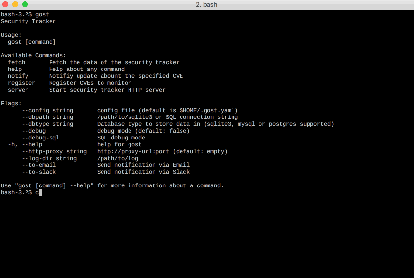

# gost (go-security-tracker)
[](https://github.com/knqyf263/gost/blob/master/LICENSE)

`gost` builds a local copy of Security Tracker(Redhat/Debian/Microsoft).   
After you register CVEs to watch list, `gost` notify via E-mail/Slack if there is an update.
The pronunciation of `gost` is the same as the English word "ghost".



# Abstract
`gost` is written in Go, and therefore you can just grab the binary releases and drop it in your $PATH.

`gost` builds a local copy of Security Tracker ([Redhat](https://access.redhat.com/security/security-updates/) or [Debian](https://security-tracker.debian.org/tracker/) or [Microsoft](https://portal.msrc.microsoft.com/en-us/security-guidance)). 

A system administrator always monitor `Security Tracker`. It can be a burden. For example, after the vulnerability is found, we have to wait until the patch comes out. I hope anyone notifies me if there is an update. 

# Main features
`gost` has the following features.
- Build a local copy of Security Tracker
- A server mode for easy querying
- Register CVEs to watch list
- Notify if there is an update (E-Mail or Slack)
- Monitoring metric can be specified (e.g. CVSS Score, Severity, etc.)

# Usage

```
$ gost
Security Tracker

Usage:
  gost [command]

Available Commands:
  fetch       Fetch the data of the security tracker
  help        Help about any command
  notify      Notifiy update abount the specified CVE
  register    Register CVEs to monitor
  server      Start security tracker HTTP server

Flags:
      --config string       config file (default is $HOME/.gost.yaml)
      --dbpath string       /path/to/sqlite3 or SQL connection string
      --dbtype string       Database type to store data in (sqlite3, mysql or postgres supported)
      --debug               debug mode (default: false)
      --debug-sql           SQL debug mode
  -h, --help                help for gost
      --http-proxy string   http://proxy-url:port (default: empty)
      --log-dir string      /path/to/log
      --log-json            output log as JSON
      --to-email            Send notification via Email
      --to-slack            Send notification via Slack

Use "gost [command] --help" for more information about a command.
```

# Fetch RedHat

## Fetch vulnerability infomation updated after 2016-01-01

```
$ gost fetch redhat 

INFO[07-27|11:13:27] Initialize Database
INFO[07-27|11:13:27] Opening DB.                              db=sqlite3
INFO[07-27|11:13:27] Migrating DB.                            db=sqlite3
INFO[07-27|11:13:27] Fetch the list of CVEs
INFO[07-27|13:59:33] Fetched 6136 CVEs
 6136 / 6136 [=================] 100.00% 8m25s
INFO[07-27|14:08:00] Insert RedHat into DB                    db=sqlite3
 0 / 6136 [--------------------]   0.00%INFO[07-27|14:08:00] Insert 6136 CVEs
 6136 / 6136 [=================] 100.00% 17s
```

# Fetch Debian

## Fetch vulnerability infomation 

```
$ gost fetch debian 

INFO[07-27|15:30:49] Initialize Database
INFO[07-27|15:30:49] Opening DB.                              db=sqlite3
INFO[07-27|15:30:49] Migrating DB.                            db=sqlite3
INFO[07-27|15:30:49] Fetched all CVEs from Debian
INFO[07-27|15:31:09] Insert Debian CVEs into DB               db=sqlite3
 21428 / 21428 [================] 100.00% 5s
```

# Fetch Microsoft

## Fetch vulnerability infomation 

```
$ gost fetch microsoft --apikey xxxxxxxx

INFO[07-27|15:30:49] Initialize Database
INFO[07-27|15:30:49] Opening DB.                              db=sqlite3
INFO[07-27|15:30:49] Migrating DB.                            db=sqlite3
INFO[07-27|15:30:49] Fetched all CVEs from Microsoft
INFO[07-27|15:31:09] Insert Microsoft CVEs into DB               db=sqlite3
 21428 / 21428 [================] 100.00% 5s
```

# Server mode

```
$ gost server
[Aug 15 21:38:44]  INFO Opening DB (sqlite3)
[Aug 15 21:38:44]  INFO Migrating DB (sqlite3)
[Aug 15 21:38:44]  INFO Starting HTTP Server...
[Aug 15 21:38:44]  INFO Listening on 127.0.0.1:1325

$ curl http://127.0.0.1:1325/redhat/cves/CVE-2017-1000117 | jq .                                                                                                                     [~]
  % Total    % Received % Xferd  Average Speed   Time    Time     Time  Current
                                 Dload  Upload   Total   Spent    Left  Speed
100  1755  100  1755    0     0   243k      0 --:--:-- --:--:-- --:--:--  285k
{
  "ID": 12,
  "ThreatSeverity": "Important",
  "PublicDate": "2017-08-10T00:00:00Z",
  "Bugzilla": {
    "RedhatCVEID": 12,
    "description": "CVE-2017-1000117 git: Command injection via malicious ssh URLs",
    "id": "1480386",
    "url": "https://bugzilla.redhat.com/show_bug.cgi?id=1480386"
  },
  "Cvss": {
    "RedhatCVEID": 0,
    "cvss_base_score": "",
    "cvss_scoring_vector": "",
    "status": ""
  },
  "Cvss3": {
    "RedhatCVEID": 12,
    "cvss3_base_score": "6.3",
    "cvss3_scoring_vector": "CVSS:3.0/AV:N/AC:L/PR:N/UI:R/S:U/C:L/I:L/A:L",
    "status": "draft"
  },
  "Iava": "",
  "Cwe": "",
  "Statement": "",
  "Acknowledgement": "",
  "Mitigation": "",
  "AffectedRelease": [],
  "PackageState": [
    {
      "RedhatCVEID": 12,
      "product_name": "Red Hat Software Collections for Red Hat Enterprise Linux",
      "fix_state": "Affected",
      "package_name": "rh-git29-git",
      "cpe": "cpe:/a:redhat:rhel_software_collections:2"
    },
    {
      "RedhatCVEID": 12,
      "product_name": "Red Hat Enterprise Linux 6",
      "fix_state": "Affected",
      "package_name": "git",
      "cpe": "cpe:/o:redhat:enterprise_linux:6"
    },
    {
      "RedhatCVEID": 12,
      "product_name": "Red Hat Enterprise Linux 7",
      "fix_state": "Affected",
      "package_name": "git",
      "cpe": "cpe:/o:redhat:enterprise_linux:7"
    }
  ],
  "Name": "CVE-2017-1000117",
  "DocumentDistribution": "Copyright © 2016 Red Hat, Inc. All rights reserved.",
  "Details": [
    {
      "RedhatCVEID": 12,
      "Detail": "Details pending"
    },
    {
      "RedhatCVEID": 12,
      "Detail": "A shell command injection flaw related to the handling of \"ssh\" URLs has been discovered in Git. An attacker could use this flaw to execute shell commands with the privileges of the user running the Git client, for example, when performing a \"clone\" action on a malicious repository or a legitimate repository containing a malicious commit."
    }
  ],
  "References": [
    {
      "RedhatCVEID": 12,
      "Reference": "https://lkml.org/lkml/2017/8/10/757\nhttp://blog.recurity-labs.com/2017-08-10/scm-vulns"
    }
  ]
}
```

# Installation

You need to install selector command (fzf or peco).

```
$ go get github.com/knqyf263/gost
```

# Docker Setup, Fetch, Run as Serer and Curl

## Fetch Debian and RedHat then start as a server mode

```
$ docker run --rm -i \ 
	 -v $PWD:/vuls \
	 -v $PWD:/var/log/gost \
	 vuls/gost fetch debian
$ docker run --rm -i \
	-v $PWD:/vuls \
	-v $PWD:/var/log/gost \
	vuls/gost fetch redhat 
$ ls 
access.log      gost.log        tracker.sqlite3

$ docker run --rm -i \
        -v $PWD:/vuls \
        -v $PWD:/var/log/gost \
        -p 1325:1325 \
        vuls/gost server --bind=0.0.0.0
```

## HTTP Get to the server on Docker

```
$ curl http://127.0.0.1:1325/debian/9/pkgs/expat/unfixed-cves | jq "."                                                                                         Fri Jul 27 16:03:15 2018
  % Total    % Received % Xferd  Average Speed   Time    Time     Time  Current
                                 Dload  Upload   Total   Spent    Left  Speed
100   970  100   970    0     0  60308      0 --:--:-- --:--:-- --:--:-- 60625
{
  "CVE-2013-0340": {
    "ID": 8452,
    "CveID": "CVE-2013-0340",
    "Scope": "remote",
    "Description": "expat 2.1.0 and earlier does not properly handle entities expansion unless an application developer uses the XML_SetEntityDeclHandler function, which allows remote attackers to cause a denial of service (resource consumption), send HTTP requests to intranet servers, or read arbitrary files via a crafted XML document, aka an XML External Entity (XXE) issue.  NOTE: it could be argued that because expat already provides the ability to disable external entity expansion, the responsibility for resolving this issue lies with application developers; according to this argument, this entry should be REJECTed, and each affected application would need its own CVE.",
    "Package": [
      {
        "ID": 9829,
        "DebianCVEID": 8452,
        "PackageName": "expat",
        "Release": [
          {
            "ID": 32048,
            "DebianPackageID": 9829,
            "ProductName": "stretch",
            "Status": "open",
            "FixedVersion": "",
            "Urgency": "unimportant",
            "Version": "2.2.0-2+deb9u1"
          }
        ]
      }
    ]
  }
}
```


# TODO
- Ubuntu(https://people.canonical.com/~ubuntu-security/cve/)

# Contribute

1. fork a repository: github.com/knqyf263/gost to github.com/you/repo
2. get original code: `go get github.com/knqyf263/gost`
3. work on original code
4. add remote to your repo: git remote add myfork https://github.com/you/repo.git
5. push your changes: git push myfork
6. create a new Pull Request

- see [GitHub and Go: forking, pull requests, and go-getting](http://blog.campoy.cat/2014/03/github-and-go-forking-pull-requests-and.html)

----

# License
MIT

# Author
Teppei Fukuda
